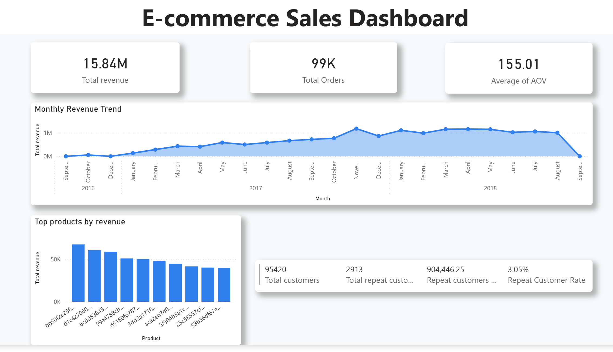

# 📊 E-commerce Sales Analysis (SQL + Power BI)

## 📌 Project Overview

This project analyzes an e-commerce transactional dataset to uncover valuable business insights related to **sales performance, product contribution, customer retention, and revenue trends**.

Using **SQL (MySQL)** for data extraction and transformation, and **Power BI** for visualization, the objective was to simulate a real-world business intelligence workflow and transform raw data into actionable decisions.

---

## 🧠 Business Problem / Justification

E-commerce businesses generate thousands of transactions, but raw data alone does not explain performance.

This analysis was developed to answer critical business questions such as:

- Is revenue growing consistently over time?
- Which products generate the highest revenue?
- Is the business dependent on a few best-selling products?
- How valuable are repeat customers?
- What retention opportunities exist?

### 🎯 Who Benefits from This Analysis?

- Business owners  
- Sales managers  
- Marketing teams  
- Data analysts  
- Growth strategists

---

## 📈 Dashboard Preview

This interactive dashboard summarizes key KPIs such as revenue, orders, AOV, top-performing products, monthly growth trends, and repeat customer contribution.



---

## 📂 Dataset Information

**Source:** Brazilian E-commerce Public Dataset by Olist (Kaggle)  
**Format:** CSV files loaded into MySQL  
**Tables Used:**

- `orders`
- `customers`
- `products`
- `order_items`
- `payments`

**Approximate Size:**

- 100k+ orders
- 95k+ customers
- 30k+ products

### Key Variables

| Variable | Description |
|--------|-------------|
| order_id | Unique identifier for each order |
| customer_unique_id | Unique customer identifier |
| order_purchase_timestamp | Purchase date/time |
| product_id | Unique product |
| price | Product sale value |
| freight_value | Shipping cost |

### Notes

- Missing values were cleaned using `NULLIF()`
- Revenue calculated as: `price + freight_value`
- Some product metadata fields contained null values

---

## 🔍 Analytical Process

## 1️⃣ Data Cleaning

- Imported multiple CSV tables into MySQL
- Converted blank values to NULL
- Validated data types (dates, decimals, integers)
- Standardized tables for joins

## 2️⃣ Exploratory Data Analysis (EDA)

- Total orders and customers
- Average items per order
- Monthly order trends
- Revenue validation
- Product sales distribution

## 3️⃣ Business Analysis

- Monthly revenue growth
- Average Order Value (AOV)
- Top 10 products by revenue
- Revenue concentration analysis
- Repeat customer rate
- Revenue from returning customers

---

## 💡 Key Findings

### 📌 1. Strong Revenue Growth Trend

Revenue increased steadily from 2017 through mid-2018, indicating healthy business expansion.

### 📌 2. Seasonal Peak in November

The highest revenue month was **November 2017**, likely influenced by Black Friday promotions and seasonal demand.

### 📌 3. Long-Tail Product Model

The **Top 10 products contributed only ~3.18% of total revenue**, meaning sales were widely distributed across many products instead of relying on a few winners.

### 📌 4. Low Retention, High Value Customers

Only **~3.05% of customers were repeat buyers**, but they generated a disproportionately higher share of revenue.

### 📌 5. Opportunity for CRM & Loyalty Programs

Increasing repeat purchase rate could significantly improve profitability with lower acquisition costs.

---

## 🛠️ Tools & Technologies

- **SQL (MySQL)**
- **Power BI**
- **Data Cleaning**
- **Exploratory Data Analysis**
- **Business Intelligence**
- **Dashboard Design**
- **Data Storytelling**

---

## 📁 Repository Structure

```bash
📦 ecommerce-sales-analysis
┣ 📂 SQL
┃ ┗ 📄 ecommerce_analysis.sql
┣ 📂 data
┃ ┣ 📄 sales_monthly.csv
┃ ┣ 📄 top_products.csv
┃ ┗ 📄 customer_metrics.csv
┣ 📂 dashboard
┃ ┗ 📄 ecommerce_dashboard.pbix
┣ 📂 images
┃ ┗ 📄 dashboard_preview.PNG
┣ 📄 README.md
┗ 📄 LICENSE
```

# 🚀 How to Use This Project
## Clone Repository
- git clone https://github.com/EstebaLoOr/ecommerce-sales-analysis.git
- cd ecommerce-sales-analysis

# 🧠 SQL Skills Demonstrated
- JOINs
- CTEs
- Aggregations
- Window Functions
- Date Functions
- Revenue Calculations
- Customer Segmentation

# 👤 Author
## Esteban López Ortega
- Github (https://github.com/EstebaLoOr)

⭐ Future Improvements
Add profit margin analysis
Customer cohort retention analysis
Category-level product insights
Geographic sales heatmaps
Predictive sales forecasting
Improved dashboard UX/UI

🤖 Notes

This project was created as part of my Data Analytics portfolio to demonstrate end-to-end analytical thinking:

Raw Data → SQL Analysis → Business Insights → Dashboard Storytelling

AI tools were used as learning support for workflow validation, documentation refinement, and best practices.


### Spanish / Español

# 📊 Análisis de Ventas E-commerce (SQL + Power BI)

## 📌 Descripción General del Proyecto

Este proyecto analiza un conjunto de datos transaccional de e-commerce para descubrir insights de negocio valiosos relacionados con **rendimiento de ventas, contribución de productos, retención de clientes y tendencias de ingresos**.

Utilizando **SQL (MySQL)** para la extracción y transformación de datos, y **Power BI** para la visualización, el objetivo fue simular un flujo de trabajo real de Business Intelligence y convertir datos crudos en decisiones accionables.

---

## 🧠 Problema de Negocio / Justificación

Los negocios de comercio electrónico generan miles de transacciones, pero los datos en bruto por sí solos no explican el desempeño del negocio.

Este análisis fue desarrollado para responder preguntas clave como:

- ¿Los ingresos están creciendo de forma constante?
- ¿Qué productos generan mayores ingresos?
- ¿El negocio depende de unos pocos productos estrella?
- ¿Qué tan valiosos son los clientes recurrentes?
- ¿Qué oportunidades existen para mejorar la retención?

### 🎯 ¿Quién se beneficia de este análisis?

- Dueños de negocio  
- Gerentes de ventas  
- Equipos de marketing  
- Analistas de datos  
- Estrategas de crecimiento

---

## 📈 Vista Previa del Dashboard

Este dashboard interactivo resume KPIs clave como ingresos, órdenes, ticket promedio (AOV), productos con mejor desempeño, tendencia mensual de ventas y contribución de clientes recurrentes.


---

## 📂 Información del Dataset

**Fuente:** Brazilian E-commerce Public Dataset by Olist (Kaggle)  
**Formato:** Archivos CSV cargados en MySQL  
**Tablas utilizadas:**

- `orders`
- `customers`
- `products`
- `order_items`
- `payments`

**Tamaño aproximado:**

- 100k+ órdenes
- 95k+ clientes
- 30k+ productos

### Variables Clave

| Variable | Descripción |
|--------|-------------|
| order_id | Identificador único de la orden |
| customer_unique_id | Identificador único del cliente |
| order_purchase_timestamp | Fecha y hora de compra |
| product_id | Identificador único del producto |
| price | Valor de venta del producto |
| freight_value | Costo de envío |

### Notas

- Los valores faltantes fueron limpiados usando `NULLIF()`
- Los ingresos fueron calculados como: `price + freight_value`
- Algunos campos de metadata de productos contenían valores nulos

---

## 🔍 Proceso Analítico

## 1️⃣ Limpieza de Datos

- Importación de múltiples tablas CSV a MySQL
- Conversión de valores vacíos a NULL
- Validación de tipos de datos (fechas, decimales, enteros)
- Estandarización de tablas para realizar JOINs

## 2️⃣ Análisis Exploratorio de Datos (EDA)

- Total de órdenes y clientes
- Promedio de artículos por orden
- Tendencia mensual de órdenes
- Validación de ingresos
- Distribución de ventas por producto

## 3️⃣ Análisis de Negocio

- Crecimiento mensual de ingresos
- Ticket promedio por orden (AOV)
- Top 10 productos por ingresos
- Concentración de ingresos
- Tasa de clientes recurrentes
- Ingresos provenientes de clientes recurrentes

---

## 💡 Hallazgos Principales

### 📌 1. Fuerte Tendencia de Crecimiento

Los ingresos aumentaron de forma constante desde 2017 hasta mediados de 2018, mostrando una expansión saludable del negocio.

### 📌 2. Pico Estacional en Noviembre

El mes con mayores ingresos fue **noviembre de 2017**, probablemente impulsado por promociones de Black Friday y demanda estacional.

### 📌 3. Modelo de Cola Larga (Long Tail)

Los **10 productos principales aportaron solo ~3.18% de los ingresos totales**, lo que indica que las ventas estuvieron distribuidas entre muchos productos y no concentradas en unos pocos.

### 📌 4. Baja Retención, Clientes de Alto Valor

Solo **~3.05% de los clientes fueron compradores recurrentes**, pero generaron una proporción mayor de ingresos.

### 📌 5. Oportunidad para CRM y Programas de Lealtad

Incrementar la tasa de recompra podría mejorar significativamente la rentabilidad al reducir costos de adquisición.

---

## 🛠️ Herramientas y Tecnologías

- **SQL (MySQL)**
- **Power BI**
- **Limpieza de Datos**
- **Análisis Exploratorio de Datos**
- **Business Intelligence**
- **Diseño de Dashboards**
- **Data Storytelling**

---

## 📁 Estructura del Repositorio

```bash
📦 ecommerce-sales-analysis
┣ 📂 SQL
┃ ┗ 📄 ecommerce_analysis.sql
┣ 📂 data
┃ ┣ 📄 sales_monthly.csv
┃ ┣ 📄 top_products.csv
┃ ┗ 📄 customer_metrics.csv
┣ 📂 dashboard
┃ ┗ 📄 ecommerce_dashboard.pbix
┣ 📂 images
┃ ┗ 📄 dashboard_preview.PNG
┣ 📄 README.md
┗ 📄 LICENSE
